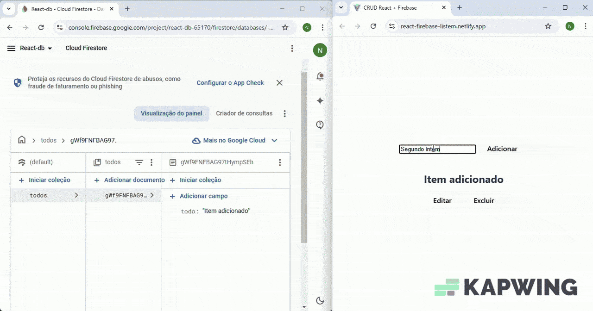

# Projeto de Lista de Tarefas com React.js e Firebase Firestore

Este projeto é uma aplicação de lista de tarefas (To-Do List) desenvolvida com React.js e integrada ao Firebase Firestore para operações de CRUD (Criar, Ler, Atualizar e Deletar).

## Funcionalidades

- Adicionar novas tarefas
- Listar todas as tarefas
- Editar tarefas existentes
- Remover tarefas

## Pré-requisitos

- Node.js instalado
- Conta no Firebase
- Projeto criado no Firebase com o Firestore habilitado 
##

### [Link do projeto](https://react-firebase-listem.netlify.app/)